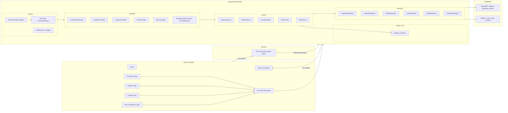

```mermaid

flowchart LR
  subgraph Frontend[React Vite SPA]
    Index[Index]
    Properties[Properties Page]
    Projects[Projects Page]
    Contact[Contact Page]
    Admin[Admin Dashboard]
    Auth[Auth Component Login]
    FetchApi[API Client fetch/axios]
  end

  subgraph Edge[Security]
    JWT[JWT Interceptor Bearer Token]
  end

  subgraph Backend[Spring Boot Monolith]
    direction TB
    subgraph Security[security]
      SecCfg[SecurityConfig Singleton]
      JwtFilter[JWT Filter - OncePerRequest]
      AuthSvc[AuthService - Strategy]
    end

    subgraph Web[controller]
      PropCtl[PropertiesController]
      ProjCtl[ProjectsController]
      CtcCtl[ContactController]
      UserCtl[UserController]
      RoleCtl[RoleController]
      ExHandler[GlobalExceptionHandler - ControllerAdvice]
    end

    subgraph App[service]
      PropSvc[PropertyService]
      ProjSvc[ProjectService]
      CtcSvc[ContactService]
      UserSvc[UserService]
      RoleSvc[RoleService]
    end

    subgraph Data[repository]
      PropRepo[PropertyRepository]
      ProjRepo[ProjectRepository]
      PhotoRepo[PhotoRepository]
      UserRepo[UserRepository]
      RoleRepo[RoleRepository]
      ContactRepo[ContactRepository]
    end

    subgraph Model[model + dto]
      Entities[Entities and DTOs]
    end

    SecCfg --> JwtFilter
    JwtFilter --> Web
    Web --> App
    App --> Data
    App --> Entities
  end

  subgraph Databases
    Mdb[MongoDB - projects, properties, photos]
    Mys[MySQL - users, roles, contacts]
  end

  Data --> Mdb
  Data --> Mys

  Frontend -->|JSON REST| JWT
  JWT -->|Authorization Bearer| Backend

  Auth --> FetchApi
  FetchApi --> Backend
  Admin <-->|role ADMIN| Backend
  Properties --> FetchApi
  Projects --> FetchApi
  Contact --> FetchApi

```
 

