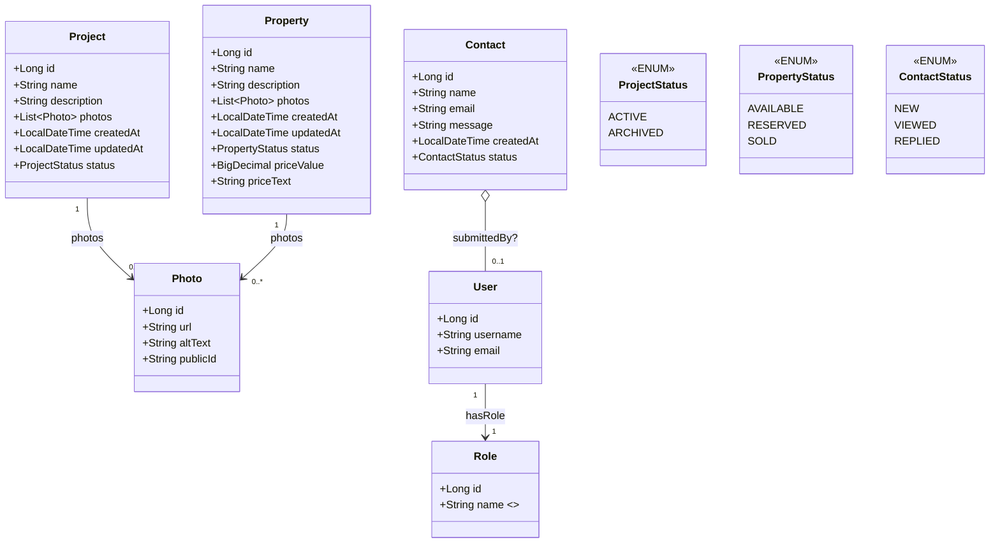

# Project specifications Propydis

>> Done is better than perfect

## 1. 🛠️ Tech Skills 

``` bash


| Component               | Recommended version | Main use                                     |
| ----------------------- | ------------------- | -------------------------------------------- |
| **Java**                | 21 (LTS)            | Base lenguage                                |
| **Spring Boot**         | 3.5.4               | Main Framework  (REST, Config, Beans)        |
| **Spring Web**          | 3.5.4               | REST Controllers (API JSON)                  |
| **Spring Security**     | 6.5.4               | Authentication + Authorization (JWT)         |
| **Spring Data JPA**     | 3.5.4               | Persistence in MySQL                         |
| **Spring Data MongoDB** | 3.5.4               | Persistence in MongoDB                       |
| **Spring Validation**   | 3.5.4               | Validation of DTOs and forms                 |
| **Springdoc OpenAPI**   | 2.8.9               | Swagger UI Documentation                     |
| **MySQL Connector**     | 8.1.0               | Driver JDBC for MySQL                        |
| **JWT (jjwt)**          | 0.11.5              | Generation and validation of tokens          |
| **Lombok**              | 1.18.34             | Reduction of boilerplate in entities and DTOs|
| **DevTools**            | 3.5.4               | Hot reload in development                    |
| **JUnit 5**             | Incluido en starter | Testing base                                 |
| **Mockito**             | 5.11.0              | Mocking in unit tests                        |
| **Reactor Test**        | 1.5.14              | Tests in reactive flows (if applicable)      |
| **Cloudinary**          | 1.29.0              | External storage of images                   |

Frontend

React
Vite

```

## 2. Roadmap

### 🛤️ Weekly Roadmap

```text

      🔹 Weekly 1 – Design + Initial Setup

- [ ] Organize mockups, define the UI flows, UML, and classes.
- [ ] Creat React project with vite.
- [ ] Start the backend in Spring Boot with entities Properties, Project, Contact, User, Role and Photos.
- [ ] Define the main backend routes (/properties, /projects, /contact...).

      🔹 Weekly 2 – API REST + Integrated Frontend

- [ ] Functional CRUD in Spring Boot.
- [ ] Connect React with the backend using fetch or axios.
- [ ] Form to register users, list properties and projects.
- [ ] Tests with Postman and necessary adjustments.

      🔹 Weekly 3 – Security and Authentication

- [ ] Implement JWT in the backend.
- [ ] Registration/Login with validation.
- [ ] Roles (User, Admin).
- [ ] In React, store the token and manage sessions.


      🔹 Weekly 4 – Refactor + Deploy

-  [ ] Flow tests.
-  [ ] Bug fixes.
-  [ ] Deployment of platform e.g.: Render, Railway for MySQL.
-  [ ] SSL certificate + domain?   


  ```

##  3. Version

```text

versión 0.1

```

##  4. Future updates

```text

version 0.2

🔹 – WebSockets + Chat in real time

- [ ] Backend: configure STOMP + SockJS.
- [ ] Frontend: integrate with React.
- [ ] Show messages in real-time.
- [ ] Chat association for each property or project.

version 0.3

🔹 – Microserviss + Docker

- [ ] Separate the backend into services (for example, one for users, another for chat).
- [ ] Communication between microservices (REST or gRPC).
- [ ] Real deployment.
- [ ] Independent database for each microservice/online.

```

##  5. Business Logic 

```text

# Propydis - Architectural Projects Showcase

🎯 Objective

A web app to showcase architectural projects and properties for sale, with differentiated roles and CRUD for administration.

Roles and permissions

Role Allowed Actions

Reader Navigate through the app, view covers, projects, and properties without details. 
User View complete details (prices, photos, descriptions) of projects and properties. 
Admin Create, update, delete projects and properties; manage users and contacts.

📦 Package structure

com.propydis.architecture
├── PropydisApplication.java  # Main class of Spring Boot
├── config          # General settings (security, CORS, etc.)
├── controller      # Controllers REST
├── service         # Business logic and services
├── repository      # Interfaces JPA / data access
├── model           # Entities (Project, Property, User, Role, Contact, Photos)
├── dto             # Data transfer objects
├── security        # JWT, filters, authentication
└── exception       # Custom error handling

```

##  6. UML



##  7. Clases

```text


🧱 Main entities

## 7. Main entities

| Entity   | Key attributes                                               | Photos relationship          |
|----------|--------------------------------------------------------------|------------------------------|
| Project  | id: Long<br>name: String<br>description: String              | 1:N (photos: List<Photo>)    |
| Property | id: Long<br>name: String<br>description: String              | 1:N (photos: List<Photo>)    |
| Photo    | id: Long<br>url: String<br>altText: String                   | N/A                          |
| User     | id: Long<br>username: String<br>email: String                | N/A                          |
| Role     | id: Long<br>name: String (READER, USER, ADMIN)               | N/A                          |
| Contact  | id: Long<br>name: String<br>email: String<br>message: String | N/A                          |

```

##  8. Mockups


## Project phrases

“Done is better than perfect”
“Progress over perfection”
“Start now, improve later


