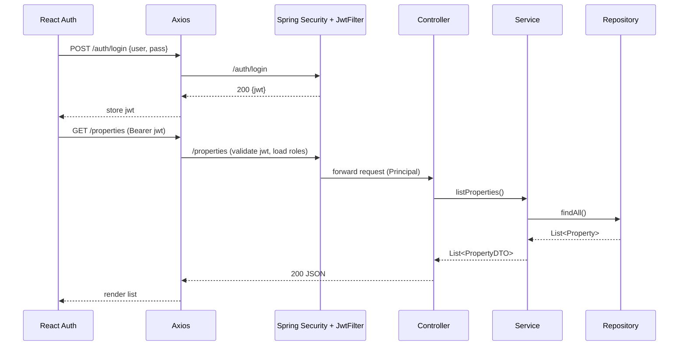

```mermaid


sequenceDiagram
  participant R as React Auth
  participant API as Axios
  participant SEC as Spring Security + JwtFilter
  participant C as Controller
  participant S as Service
  participant REPO as Repository

  R->>API: POST /auth/login {user, pass}
  API->>SEC: /auth/login
  SEC-->>API: 200 {jwt}
  API-->>R: store jwt

  R->>API: GET /properties (Bearer jwt)
  API->>SEC: /properties (validate jwt, load roles)
  SEC->>C: forward request (Principal)
  C->>S: listProperties()
  S->>REPO: findAll()
  REPO-->>S: List<Property>
  S-->>C: List<PropertyDTO>
  C-->>API: 200 JSON
  API-->>R: render list


```

